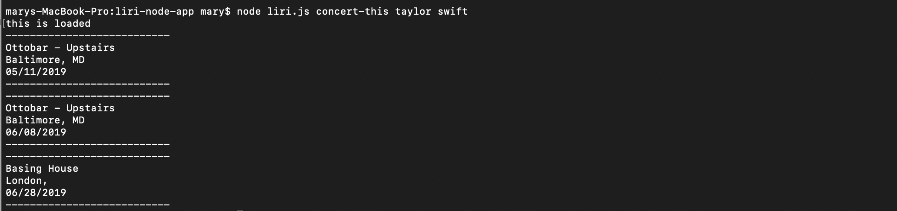

# LIRI BOT
----------------

LIRI is like iPhone's SIRI. However, while SIRI is a Speech Interpretation and Recognition Interface, LIRI is a Language Interpretation and Recognition Interface. LIRI is a command line node app that takes in parameters and gives you back data.

LIRI will search Spotify for songs, Bands in Town for concerts, and OMDB for movies.

---------------

In order to run this app, you'll need to install:

Node-spotify-API

Axios (npm install axios)

Moment (npm i moment)

JSON package

---------------

These are the possible inputs:

node liri.js concert-this <artist/band name here>

node liri.js spotify-this-song '<song name here>'

node liri.js movie-this '<movie name here>'

node liri.js do-what-it-says

(LIRI will take the text inside of random.txt and then use it to call one of LIRI's commands.)

----------------

Technologies Used:

Spotify API

OMDB API

Bands In Town API

Node.js

Javascript

NPM packages

